# Python 学习课程体系 - 学习路径图

本文档详细展示了 Python 学习课程体系的完整学习路径、阶段依赖关系和知识图谱。

## 整体学习路径

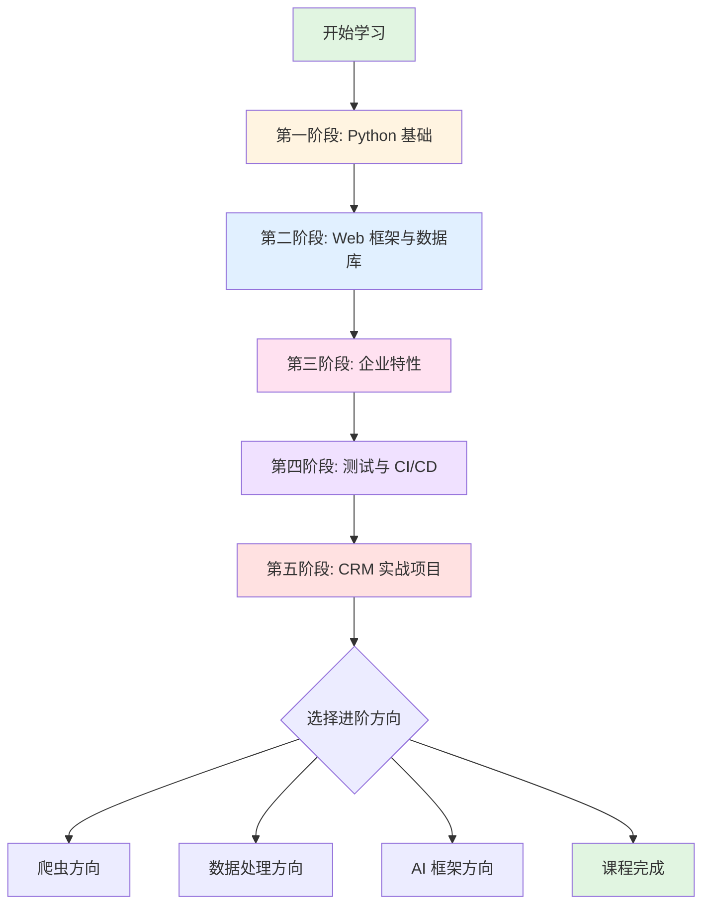

## 阶段依赖关系

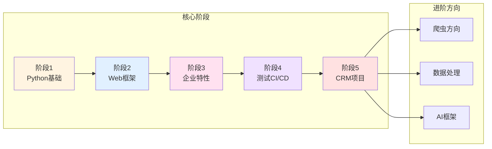

## 第一阶段：Python 基础

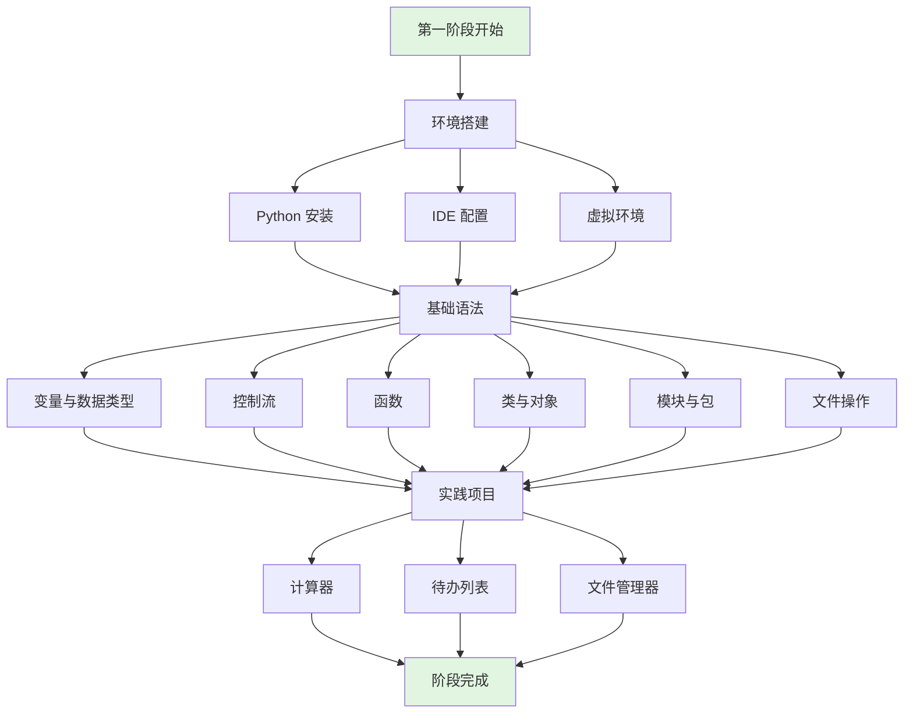

**学习目标**:
- 掌握 Python 开发环境搭建
- 理解 Python 基础语法和编程概念
- 能够编写简单的 Python 程序
- 理解面向对象编程思想

**产出**:
- 3 个基础实践项目
- 掌握虚拟环境管理
- 熟悉 IDE 使用

**预计时间**: 2-3 周

---

## 第二阶段：Web 框架与数据库

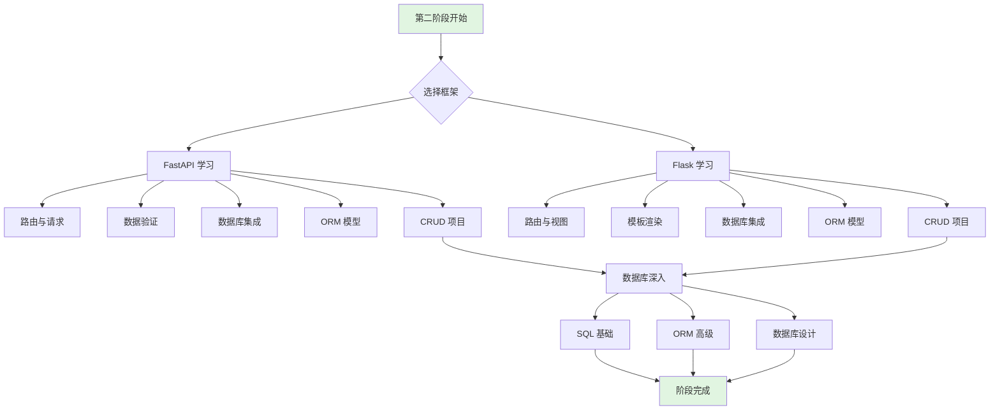

**学习目标**:
- 掌握 FastAPI 和 Flask 两个主流框架
- 理解 RESTful API 设计原则
- 掌握数据库操作和 ORM 使用
- 能够开发基本的 Web 应用

**产出**:
- FastAPI CRUD 应用
- Flask CRUD 应用
- 数据库设计能力

**预计时间**: 3-4 周

---

## 第三阶段：企业特性

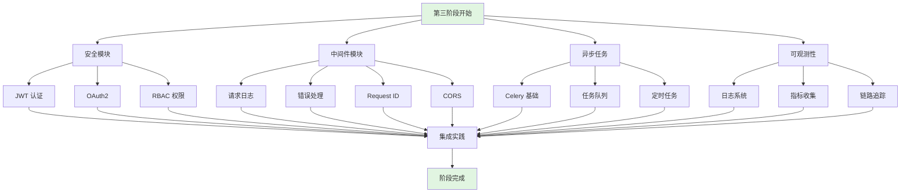

**学习目标**:
- 掌握企业级应用的安全机制
- 理解中间件的作用和开发方法
- 掌握异步任务处理
- 了解系统可观测性实践

**产出**:
- 完整的认证授权系统
- 中间件集成方案
- 异步任务处理系统

**预计时间**: 3-4 周

---

## 第四阶段：测试与 CI/CD

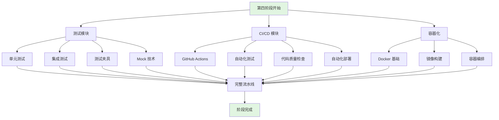

**学习目标**:
- 掌握自动化测试方法
- 理解 CI/CD 流程
- 掌握 Docker 容器化技术
- 能够搭建完整的自动化流水线

**产出**:
- 完整的测试套件
- CI/CD 自动化配置
- Docker 部署方案

**预计时间**: 2-3 周

---

## 第五阶段：CRM 实战项目

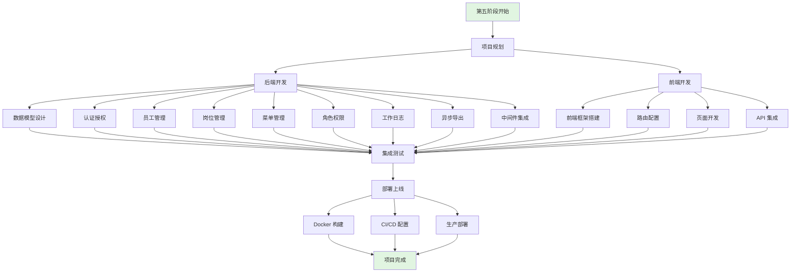

**学习目标**:
- 整合前四个阶段的所有知识
- 开发完整的企业级应用
- 掌握前后端分离架构
- 具备独立开发能力

**产出**:
- 完整的 CRM 系统（FastAPI/Flask 双版本）
- 前后端分离应用
- 生产级部署配置
- 可展示的项目经验

**预计时间**: 4-6 周

---

## 进阶选学路径

### 爬虫方向

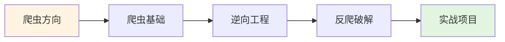

**适合人群**: 对数据采集、自动化感兴趣的学员

**主要内容**: Scrapy、Selenium、逆向分析、反爬策略

### 数据处理方向

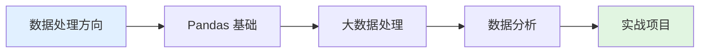

**适合人群**: 对数据分析、商业智能感兴趣的学员

**主要内容**: Pandas、NumPy、数据可视化、统计分析

### AI 框架方向

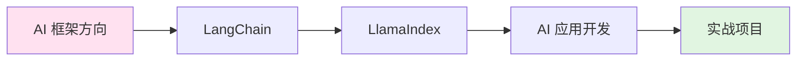

**适合人群**: 对 AI 应用开发感兴趣的学员

**主要内容**: LangChain、LlamaIndex、RAG、AI Agent

---

## 知识体系图谱

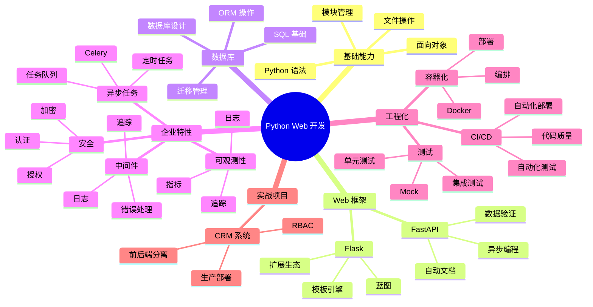

---

## 学习时间规划

### 全职学习（每天 6-8 小时）

| 阶段 | 内容 | 预计时间 | 累计时间 |
|------|------|----------|----------|
| 阶段 1 | Python 基础 | 2-3 周 | 2-3 周 |
| 阶段 2 | Web 框架与数据库 | 3-4 周 | 5-7 周 |
| 阶段 3 | 企业特性 | 3-4 周 | 8-11 周 |
| 阶段 4 | 测试与 CI/CD | 2-3 周 | 10-14 周 |
| 阶段 5 | CRM 实战项目 | 4-6 周 | 14-20 周 |
| **总计** | **核心五阶段** | **14-20 周** | **3.5-5 个月** |

### 业余学习（每天 2-3 小时）

| 阶段 | 内容 | 预计时间 | 累计时间 |
|------|------|----------|----------|
| 阶段 1 | Python 基础 | 4-6 周 | 4-6 周 |
| 阶段 2 | Web 框架与数据库 | 6-8 周 | 10-14 周 |
| 阶段 3 | 企业特性 | 6-8 周 | 16-22 周 |
| 阶段 4 | 测试与 CI/CD | 4-6 周 | 20-28 周 |
| 阶段 5 | CRM 实战项目 | 8-12 周 | 28-40 周 |
| **总计** | **核心五阶段** | **28-40 周** | **7-10 个月** |

### 周末学习（每周 10-15 小时）

| 阶段 | 内容 | 预计时间 | 累计时间 |
|------|------|----------|----------|
| 阶段 1 | Python 基础 | 6-8 周 | 6-8 周 |
| 阶段 2 | Web 框架与数据库 | 8-10 周 | 14-18 周 |
| 阶段 3 | 企业特性 | 8-10 周 | 22-28 周 |
| 阶段 4 | 测试与 CI/CD | 6-8 周 | 28-36 周 |
| 阶段 5 | CRM 实战项目 | 10-14 周 | 38-50 周 |
| **总计** | **核心五阶段** | **38-50 周** | **9-12 个月** |

---

## 学习检查点

### 第一阶段检查点
- [ ] 能够独立搭建 Python 开发环境
- [ ] 理解并能使用虚拟环境
- [ ] 掌握 Python 基础语法
- [ ] 理解面向对象编程
- [ ] 完成 3 个基础实践项目

### 第二阶段检查点
- [ ] 能够使用 FastAPI 开发 API
- [ ] 能够使用 Flask 开发 Web 应用
- [ ] 掌握数据库操作和 ORM
- [ ] 理解 RESTful API 设计
- [ ] 完成 CRUD 应用开发

### 第三阶段检查点
- [ ] 实现 JWT 认证系统
- [ ] 实现 RBAC 权限控制
- [ ] 开发自定义中间件
- [ ] 使用 Celery 处理异步任务
- [ ] 集成日志和监控

### 第四阶段检查点
- [ ] 编写单元测试和集成测试
- [ ] 配置 GitHub Actions 工作流
- [ ] 使用 Docker 容器化应用
- [ ] 实现自动化部署流程
- [ ] 理解 CI/CD 最佳实践

### 第五阶段检查点
- [ ] 完成 CRM 后端开发
- [ ] 完成前端集成
- [ ] 实现完整的权限系统
- [ ] 配置生产环境部署
- [ ] 项目可以正常运行和演示

---

## 学习建议

### 按阶段学习
1. **不要跳过**: 每个阶段都是后续学习的基础
2. **完成项目**: 实践项目是检验学习成果的最好方式
3. **使用检查清单**: 每个阶段都有知识点检查清单

### 遇到困难时
1. 查阅 `common/troubleshooting.md`
2. 重新阅读相关文档
3. 运行示例代码对比
4. 查阅官方文档
5. 搜索社区资源

### 学习节奏
- **不要急于求成**: 理解比速度更重要
- **定期复习**: 巩固已学知识
- **记录笔记**: 记录重要概念和问题
- **多动手**: 编程是实践的技能

---

## 下一步

准备好开始学习了吗？

👉 [开始第一阶段：Python 基础](./stage1_basics/README.md)

或者查看 [课程总览](./README.md) 了解更多信息。
