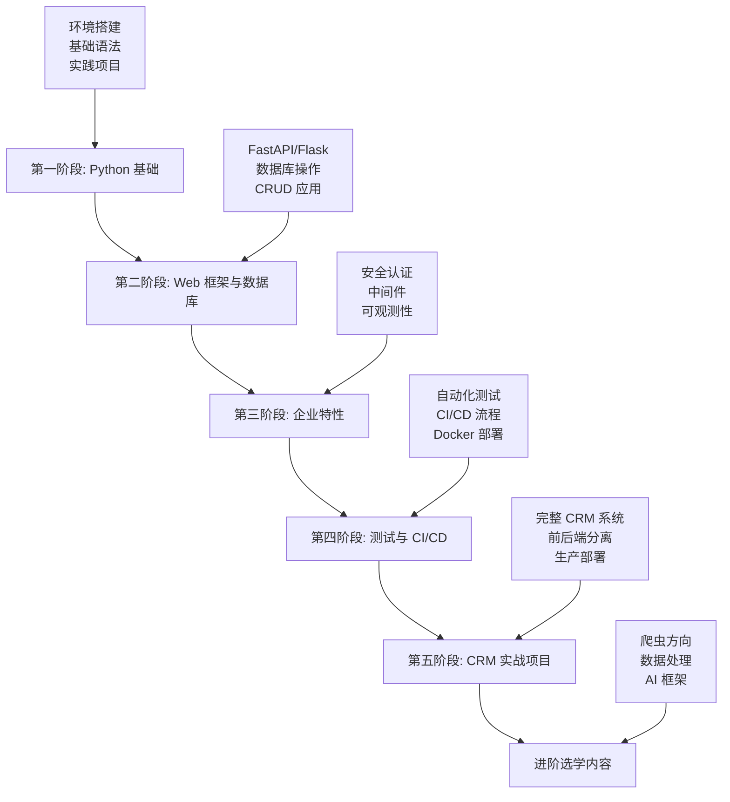

# Python 学习课程体系

## 课程简介

欢迎来到完整的 Python 学习课程体系！这是一个从零基础到企业级项目实战的系统性学习路径，通过五个递进式阶段，帮助你掌握现代 Python Web 开发的核心技能。

## 🎯 学习目标

完成整个课程体系后，你将能够：

- 熟练掌握 Python 编程语言
- 使用 FastAPI 和 Flask 开发 Web 应用
- 掌握数据库设计和 ORM 操作
- 实现用户认证、权限控制等企业特性
- 编写测试代码和实现 CI/CD 流程
- 独立开发完整的企业级 CRM 系统
- 在爬虫、数据处理、AI 等方向进行专业发展

## 📚 课程结构

### 🏗️ 五个核心阶段



### 📖 详细内容

| 阶段 | 学习内容 | 预计时间 | 核心技能 |
|------|----------|----------|----------|
| **第一阶段** | Python 基础 | 2-4 周 | 语法、数据类型、函数、类 |
| **第二阶段** | Web 框架与数据库 | 4-6 周 | FastAPI、Flask、SQLAlchemy |
| **第三阶段** | 企业特性 | 3-4 周 | 认证、中间件、异步任务 |
| **第四阶段** | 测试与 CI/CD | 2-3 周 | 自动化测试、Docker、部署 |
| **第五阶段** | CRM 实战项目 | 4-6 周 | 完整项目开发 |
| **进阶选学** | 专业方向 | 按需学习 | 爬虫、数据处理、AI |

## 🚀 快速开始

### 前置要求

- 基本的计算机操作能力
- 对编程有兴趣和学习热情
- 无需任何编程经验

### 环境准备

1. **安装 Python**
   ```bash
   # 下载并安装 Python 3.9+
   # https://www.python.org/downloads/
   python --version  # 验证安装
   ```

2. **选择开发工具**
   - [PyCharm Community](https://www.jetbrains.com/pycharm/) (推荐新手)
   - [VSCode](https://code.visualstudio.com/) (轻量级)

3. **创建学习目录**
   ```bash
   mkdir python-learning
   cd python-learning
   git clone <this-repo>  # 或下载课程材料
   ```

### 开始学习

1. 从 [第一阶段：Python 基础](stage1_basics/README.md) 开始
2. 按照每个阶段的 README 指导进行学习
3. 完成所有示例代码和实践项目
4. 使用检查清单进行自我评估

## 📋 学习路径详解

### 🔰 第一阶段：Python 基础 (2-4 周)

**目标**: 掌握 Python 编程基础

**内容**:
- 环境搭建和工具使用
- 变量、数据类型、控制流
- 函数、类和面向对象编程
- 模块、包和文件操作
- 3个实践项目（计算器、待办事项、文件管理器）

**产出**: 能够编写基本的 Python 程序

### 🌐 第二阶段：Web 框架与数据库 (4-6 周)

**目标**: 掌握 Web 开发基础

**内容**:
- FastAPI 现代异步框架
- Flask 轻量级框架
- SQL 基础和数据库操作
- SQLAlchemy ORM 使用
- RESTful API 设计

**产出**: 能够开发基本的 Web API 和数据库应用

### 🏢 第三阶段：企业特性 (3-4 周)

**目标**: 掌握企业级应用开发

**内容**:
- JWT 认证和 RBAC 权限控制
- 中间件开发（日志、错误处理、请求追踪）
- 异步任务处理（Celery + Redis）
- 可观测性（日志、指标、追踪）

**产出**: 能够开发具备企业特性的应用

### 🔧 第四阶段：测试与 CI/CD (2-3 周)

**目标**: 掌握工程化开发流程

**内容**:
- 单元测试和集成测试（pytest）
- GitHub Actions CI/CD 流程
- Docker 容器化部署
- 代码质量和自动化

**产出**: 能够实现完整的开发到部署流程

### 💼 第五阶段：CRM 实战项目 (4-6 周)

**目标**: 开发完整的企业级项目

**内容**:
- 员工管理、岗位管理、角色权限
- 菜单管理、工作日志系统
- 前后端分离架构
- 生产环境部署

**产出**: 一个完整的 CRM 系统，可作为求职作品

### 🚀 进阶选学内容 (按需学习)

**三个专业方向**:

1. **爬虫方向**: 数据采集、反爬破解、分布式爬虫
2. **数据处理**: Pandas、大数据处理、数据分析
3. **AI 框架**: LangChain、LlamaIndex、智能应用开发

## 🛠️ 技术栈

### 核心技术

- **语言**: Python 3.9+
- **Web 框架**: FastAPI, Flask
- **数据库**: SQLite, MySQL, PostgreSQL
- **ORM**: SQLAlchemy
- **认证**: JWT, OAuth2
- **异步**: Celery, Redis
- **测试**: pytest
- **部署**: Docker, Docker Compose
- **CI/CD**: GitHub Actions

### 开发工具

- **IDE**: PyCharm, VSCode
- **版本控制**: Git
- **API 测试**: Postman, Swagger UI
- **数据库工具**: DBeaver, phpMyAdmin
- **容器**: Docker Desktop

## 📖 学习资源

### 官方文档

- [Python 官方文档](https://docs.python.org/zh-cn/3/)
- [FastAPI 文档](https://fastapi.tiangolo.com/zh/)
- [Flask 文档](https://flask.palletsprojects.com/)
- [SQLAlchemy 文档](https://docs.sqlalchemy.org/)

### 推荐书籍

- 《Python编程：从入门到实践》
- 《Flask Web开发实战》
- 《Python Web开发实战》
- 《SQL必知必会》

### 在线资源

- [菜鸟教程 - Python](https://www.runoob.com/python3/python3-tutorial.html)
- [廖雪峰 Python 教程](https://www.liaoxuefeng.com/wiki/1016959663602400)
- [Real Python](https://realpython.com/)

## 💡 学习建议

### 学习方法

1. **循序渐进**: 按阶段顺序学习，不要跳跃
2. **动手实践**: 运行所有示例代码，完成所有项目
3. **主动思考**: 理解代码背后的原理，不要只是复制
4. **记录笔记**: 整理重要概念和常见问题
5. **寻求帮助**: 遇到问题及时查阅文档或寻求帮助

### 时间规划

- **总学习时间**: 15-25 周（约 4-6 个月）
- **每日学习**: 2-3 小时
- **每周学习**: 5-6 天
- **项目时间**: 占总时间的 40-50%

### 学习节奏

- 理论学习 30% + 代码实践 50% + 项目开发 20%
- 每完成一个阶段，休息 1-2 天巩固知识
- 定期回顾之前学过的内容

## 🎓 学习成果

### 技能证明

完成课程后，你将拥有：

1. **代码作品集**: 多个完整的项目代码
2. **CRM 系统**: 可演示的企业级应用
3. **技术博客**: 学习笔记和技术总结
4. **开源贡献**: 参与开源项目的经验

### 就业方向

- **Python 后端开发工程师**
- **Web 全栈开发工程师**
- **API 开发工程师**
- **数据工程师**（选学数据处理方向）
- **爬虫工程师**（选学爬虫方向）
- **AI 应用开发工程师**（选学 AI 方向）

## 🤝 获取帮助

### 学习支持

1. **文档查阅**: 每个阶段都有详细的 README 和示例
2. **故障排除**: 查看 [故障排除指南](common/troubleshooting.md)
3. **社区讨论**: 参与 Python 社区讨论
4. **在线搜索**: Stack Overflow, GitHub Issues

### 常见问题

- **Q: 零基础能学会吗？**
  A: 可以！课程从零开始，循序渐进。

- **Q: 需要多长时间？**
  A: 4-6 个月，因人而异。重要的是理解概念。

- **Q: 需要什么基础？**
  A: 只需要基本的计算机操作能力和学习热情。

- **Q: 如何选择学习方向？**
  A: 先完成核心五个阶段，再根据兴趣选择进阶方向。

## 📈 学习进度跟踪

### 检查清单

每个阶段都提供了详细的知识点检查清单：

- [ ] [第一阶段检查清单](stage1_basics/checklist.md)
- [ ] [第二阶段检查清单](stage2_frameworks/checklist.md)
- [ ] [第三阶段检查清单](stage3_enterprise/checklist.md)
- [ ] [第四阶段检查清单](stage4_cicd/checklist.md)
- [ ] [第五阶段检查清单](stage5_crm_project/checklist.md)

### 学习记录

建议创建学习日志，记录：

- 每日学习内容和时间
- 遇到的问题和解决方案
- 重要概念和心得体会
- 项目开发进度

## 🌟 开始你的 Python 之旅

准备好了吗？让我们从第一步开始：

👉 [开始第一阶段：Python 基础](stage1_basics/README.md)

---

**祝你学习愉快，成为优秀的 Python 开发者！** 🐍✨

## 📄 许可证

本课程内容采用 MIT 许可证，欢迎学习、分享和改进。

## 🙏 致谢

感谢所有为 Python 生态系统做出贡献的开发者们！