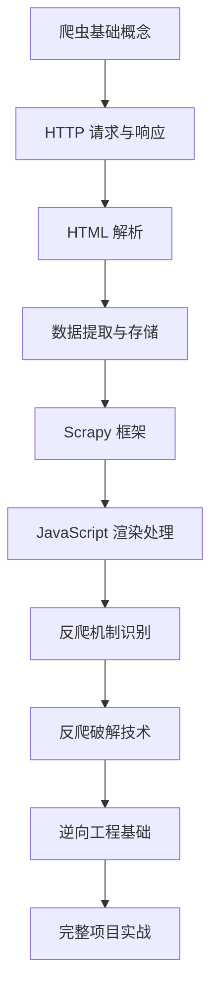

# Python 爬虫学习模块

## 模块简介

本模块提供完整的 Python 爬虫学习资源，从基础的网页抓取到高级的逆向工程和反爬破解技术。通过系统性的学习和实践，帮助学员掌握现代爬虫开发的核心技能。

## 学习目标

完成本模块学习后，学员将能够：

- 掌握 Python 爬虫的基础概念和常用库
- 理解 HTTP 协议和网页结构分析
- 熟练使用 requests、BeautifulSoup、Scrapy 等爬虫框架
- 掌握 JavaScript 渲染页面的处理方法
- 了解常见的反爬机制和应对策略
- 具备基础的逆向工程能力
- 能够开发完整的爬虫项目

## 前置知识

- Python 基础语法（变量、函数、类、异常处理）
- HTTP 协议基础知识
- HTML/CSS 基础
- 正则表达式
- 数据库操作（可选）

## 学习路径



## 模块结构

```
web_scraping/
├── README.md                    # 本文件
├── basics/                      # 爬虫基础
│   ├── 01_http_requests.py     # HTTP 请求基础
│   ├── 02_html_parsing.py      # HTML 解析
│   ├── 03_data_extraction.py   # 数据提取
│   ├── 04_scrapy_intro.py      # Scrapy 入门
│   └── 05_selenium_basics.py   # Selenium 基础
├── reverse_engineering/         # 逆向工程
│   ├── 01_js_analysis.py       # JavaScript 分析
│   ├── 02_api_discovery.py     # API 接口发现
│   ├── 03_encryption_decode.py # 加密参数解析
│   └── 04_mobile_app.py        # 移动端抓包
├── anti_scraping/              # 反爬破解
│   ├── 01_user_agent.py        # User-Agent 处理
│   ├── 02_cookies_session.py   # Cookie 和会话管理
│   ├── 03_proxy_rotation.py    # 代理轮换
│   ├── 04_captcha_solving.py   # 验证码识别
│   └── 05_rate_limiting.py     # 频率限制应对
├── projects/                   # 实战项目
│   ├── project1_news_scraper/  # 新闻爬虫
│   ├── project2_ecommerce/     # 电商数据爬虫
│   └── project3_social_media/  # 社交媒体爬虫
└── resources.md                # 学习资源
```

## 技术栈

### 基础库
- **requests**: HTTP 请求库
- **urllib**: Python 标准库
- **BeautifulSoup4**: HTML/XML 解析
- **lxml**: 高性能 XML/HTML 解析器
- **Scrapy**: 专业爬虫框架

### JavaScript 处理
- **Selenium**: 浏览器自动化
- **Playwright**: 现代浏览器自动化
- **requests-html**: JavaScript 支持的 requests

### 数据处理
- **pandas**: 数据分析和处理
- **numpy**: 数值计算
- **pymongo**: MongoDB 操作
- **sqlalchemy**: SQL 数据库 ORM

### 反爬工具
- **fake-useragent**: User-Agent 伪造
- **requests-oauthlib**: OAuth 认证
- **captcha-solver**: 验证码识别
- **proxy-rotator**: 代理轮换

## 环境搭建

### 1. 安装基础依赖

```bash
# 创建虚拟环境
python -m venv venv
source venv/bin/activate  # Linux/Mac
# 或
venv\Scripts\activate     # Windows

# 安装基础包
pip install requests beautifulsoup4 lxml scrapy selenium pandas
```

### 2. 安装浏览器驱动

```bash
# Chrome 驱动（推荐使用 webdriver-manager 自动管理）
pip install webdriver-manager

# 或手动下载对应版本的 ChromeDriver
# https://chromedriver.chromium.org/
```

### 3. 可选工具安装

```bash
# 代理工具
pip install requests[socks] pysocks

# 验证码识别
pip install pillow opencv-python pytesseract

# 数据库支持
pip install pymongo sqlalchemy psycopg2-binary
```

## 学习建议

### 1. 循序渐进
- 先掌握基础的 HTTP 请求和 HTML 解析
- 逐步学习更复杂的反爬技术
- 最后进行完整项目实战

### 2. 实践为主
- 每个概念都要动手实践
- 尝试爬取不同类型的网站
- 遇到反爬机制时分析和解决

### 3. 法律合规
- 遵守网站的 robots.txt 协议
- 不要对服务器造成过大压力
- 尊重网站的使用条款
- 不爬取个人隐私信息

### 4. 技术更新
- 关注爬虫技术的最新发展
- 学习新的反爬技术和应对方法
- 参与开源项目和社区讨论

## 常见问题

### Q: 爬虫是否合法？
A: 爬虫技术本身是合法的，但使用时需要遵守相关法律法规和网站条款。建议：
- 只爬取公开信息
- 遵守 robots.txt 协议
- 不要对服务器造成过大负担
- 不用于商业用途时需获得授权

### Q: 如何处理动态加载的内容？
A: 对于 JavaScript 渲染的页面，可以使用：
- Selenium 模拟浏览器行为
- Playwright 进行现代浏览器自动化
- 分析 AJAX 请求直接调用 API
- 使用 requests-html 处理简单的 JS 渲染

### Q: 如何提高爬虫效率？
A: 可以通过以下方式优化：
- 使用异步请求（aiohttp）
- 合理设置并发数
- 使用连接池
- 缓存重复请求
- 优化数据存储方式

## 进阶学习

完成本模块后，可以继续学习：

1. **分布式爬虫**: Scrapy-Redis、Celery 分布式任务
2. **大规模爬虫**: 集群部署、监控告警
3. **机器学习应用**: 智能内容识别、自动化决策
4. **移动端爬虫**: App 逆向、协议分析
5. **实时数据处理**: 流式处理、实时分析

## 参考资源

- [Scrapy 官方文档](https://docs.scrapy.org/)
- [Selenium 官方文档](https://selenium-python.readthedocs.io/)
- [requests 官方文档](https://requests.readthedocs.io/)
- [BeautifulSoup 官方文档](https://www.crummy.com/software/BeautifulSoup/bs4/doc/)

---

**注意**: 本模块仅用于学习和研究目的，请在使用爬虫技术时遵守相关法律法规和道德规范。