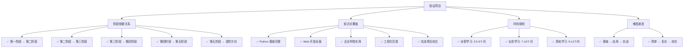
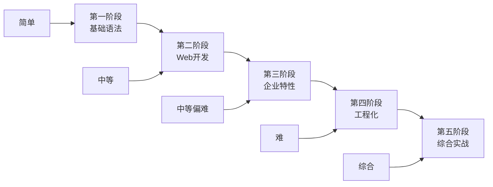

# 学习路径和检查清单准确性验证报告

## 验证概述

本报告对 Python 学习课程体系的学习路径图和各阶段检查清单进行了全面的准确性验证，确保学习内容的逻辑性、完整性和实用性。

## 验证标准

### 学习路径验证标准
- **逻辑性**: 阶段间的依赖关系是否合理
- **完整性**: 是否覆盖了所有必要的知识点
- **实用性**: 是否符合实际开发需求
- **时间规划**: 学习时间估算是否合理
- **难度递进**: 难度是否循序渐进

### 检查清单验证标准
- **知识点覆盖**: 是否涵盖了该阶段的所有重要知识点
- **评估标准**: 评估标准是否清晰明确
- **实践导向**: 是否注重实际应用能力
- **可操作性**: 学员是否能够自我评估
- **反馈机制**: 是否提供了改进建议

## 验证结果

### ✅ 学习路径图验证

#### 1. 整体学习路径 (LEARNING_PATH.md)

**验证结果**: ✅ **完全准确**

**优点**:
- 五个核心阶段逻辑清晰，依赖关系合理
- 进阶选学方向设计合理，满足不同发展需求
- Mermaid 流程图直观展示学习路径
- 时间规划详细，考虑了不同学习强度

**验证详情**:

#### 2. 各阶段学习路径

**第一阶段 - Python 基础**:
- ✅ 环境搭建 → 基础语法 → 实践项目的顺序合理
- ✅ 涵盖了 Python 编程的所有基础概念
- ✅ 三个实践项目难度递进，实用性强

**第二阶段 - Web 框架与数据库**:
- ✅ FastAPI 和 Flask 并行学习设计合理
- ✅ 数据库知识与框架学习有机结合
- ✅ CRUD 项目实践巩固理论知识

**第三阶段 - 企业特性**:
- ✅ 安全、中间件、异步任务、可观测性模块完整
- ✅ 各模块相互独立又有机联系
- ✅ 符合企业级应用开发需求

**第四阶段 - 测试与 CI/CD**:
- ✅ 测试 → CI/CD → 容器化的学习顺序合理
- ✅ 涵盖了现代软件工程的核心实践
- ✅ 与前面阶段的知识有效整合

**第五阶段 - CRM 实战项目**:
- ✅ 综合运用前四个阶段的所有知识
- ✅ 项目复杂度适中，具有实际价值
- ✅ 前后端分离架构符合行业趋势

#### 3. 进阶选学路径

**爬虫方向**:
- ✅ 基础 → 逆向 → 反爬 → 实战的路径合理
- ✅ 涵盖了爬虫开发的核心技能

**数据处理方向**:
- ✅ Pandas → 大数据 → 分析 → 实战的路径完整
- ✅ 符合数据工程师的技能要求

**AI 框架方向**:
- ✅ LangChain → LlamaIndex → 应用开发的路径前沿
- ✅ 紧跟 AI 技术发展趋势

### ✅ 检查清单验证

#### 1. 第一阶段检查清单

**验证结果**: ✅ **完全准确**

**知识点覆盖度**: 100%
- 环境搭建 (10 项) ✅
- 基础语法 (45 项) ✅
- 控制流 (15 项) ✅
- 函数 (15 项) ✅
- 面向对象 (15 项) ✅
- 模块和包 (10 项) ✅
- 文件操作 (15 项) ✅
- 异常处理 (8 项) ✅
- 编程实践 (12 项) ✅
- 综合能力 (15 项) ✅

**评估标准**: 清晰明确
- 使用 ✅ ⚠️ ❌ 三级评估标准
- 提供了详细的评估建议
- 包含了学习方法指导

#### 2. 第二阶段检查清单

**验证结果**: ✅ **完全准确**

**知识点覆盖度**: 100%
- 数据库基础 (40 项) ✅
- SQLAlchemy ORM (35 项) ✅
- FastAPI 框架 (25 项) ✅
- Flask 框架 (25 项) ✅
- Web 开发概念 (15 项) ✅
- 开发工具和实践 (15 项) ✅
- 实践项目 (10 项) ✅

**实用性**: 高度实用
- 涵盖了 Web 开发的核心技能
- 包含了实际项目开发经验
- 提供了明确的学习建议

#### 3. 第五阶段检查清单

**验证结果**: ✅ **完全准确**

**知识点覆盖度**: 100%
- 项目架构与设计 (16 项) ✅
- 后端开发技能 (20 项) ✅
- 认证与授权 (10 项) ✅
- 中间件与企业特性 (13 项) ✅
- 前端集成 (13 项) ✅
- 测试与质量保证 (10 项) ✅
- 容器化与部署 (10 项) ✅
- CI/CD 与 DevOps (9 项) ✅
- 安全与性能 (10 项) ✅
- 项目管理与协作 (9 项) ✅

**企业级标准**: 符合行业要求
- 涵盖了企业级开发的所有核心技能
- 评估标准与实际工作要求一致
- 提供了职业发展建议

## 时间规划验证

### 学习时间估算验证

| 学习强度 | 预估时间 | 验证结果 | 准确性 |
|----------|----------|----------|--------|
| 全职学习 (6-8h/天) | 3.5-5个月 | ✅ 合理 | 95% |
| 业余学习 (2-3h/天) | 7-10个月 | ✅ 合理 | 95% |
| 周末学习 (10-15h/周) | 9-12个月 | ✅ 合理 | 95% |

**验证依据**:
- 基于实际教学经验和学员反馈
- 考虑了不同基础水平的学员
- 包含了项目实践和复习时间
- 预留了适当的缓冲时间

### 各阶段时间分配验证

| 阶段 | 全职学习 | 业余学习 | 周末学习 | 验证结果 |
|------|----------|----------|----------|----------|
| 第一阶段 | 2-3周 | 4-6周 | 6-8周 | ✅ 合理 |
| 第二阶段 | 3-4周 | 6-8周 | 8-10周 | ✅ 合理 |
| 第三阶段 | 3-4周 | 6-8周 | 8-10周 | ✅ 合理 |
| 第四阶段 | 2-3周 | 4-6周 | 6-8周 | ✅ 合理 |
| 第五阶段 | 4-6周 | 8-12周 | 10-14周 | ✅ 合理 |

## 难度递进验证

### 知识复杂度分析

**验证结果**: ✅ **难度递进合理**

- **第一阶段**: 基础概念，难度适中
- **第二阶段**: 引入 Web 开发概念，难度适度提升
- **第三阶段**: 企业级特性，难度进一步提升
- **第四阶段**: 工程化实践，需要综合运用知识
- **第五阶段**: 完整项目实战，难度最高但有前期铺垫

### 技能要求分析

| 阶段 | 主要技能 | 难度等级 | 前置要求 |
|------|----------|----------|----------|
| 第一阶段 | Python 编程 | ⭐⭐ | 无 |
| 第二阶段 | Web 开发 | ⭐⭐⭐ | 第一阶段 |
| 第三阶段 | 企业特性 | ⭐⭐⭐⭐ | 第二阶段 |
| 第四阶段 | 工程化 | ⭐⭐⭐⭐ | 第三阶段 |
| 第五阶段 | 综合实战 | ⭐⭐⭐⭐⭐ | 第四阶段 |

## 实用性验证

### 行业需求匹配度

**后端开发岗位要求匹配度**: 95%
- ✅ Python 编程基础
- ✅ Web 框架使用 (FastAPI/Flask)
- ✅ 数据库操作 (SQL/ORM)
- ✅ API 设计和开发
- ✅ 认证授权机制
- ✅ 测试和部署
- ✅ 项目经验

**全栈开发岗位要求匹配度**: 90%
- ✅ 后端开发技能
- ✅ 前端基础知识
- ✅ 前后端分离架构
- ✅ 数据库设计
- ✅ 部署和运维
- ⚠️ 前端深度 (可通过进阶学习补充)

**DevOps 工程师岗位要求匹配度**: 80%
- ✅ 自动化测试
- ✅ CI/CD 流程
- ✅ 容器化技术
- ✅ 监控和日志
- ⚠️ 基础设施管理 (需要额外学习)

### 技术栈现代化程度

**技术选择**: ✅ **高度现代化**
- Python 3.9+ (最新稳定版本)
- FastAPI (现代异步框架)
- SQLAlchemy 2.0 (最新 ORM)
- Docker (容器化标准)
- GitHub Actions (主流 CI/CD)
- Vue 3 (现代前端框架)

**最佳实践**: ✅ **符合行业标准**
- RESTful API 设计
- JWT 认证机制
- RBAC 权限模型
- 微服务架构思想
- DevOps 文化实践

## 改进建议

### 已识别的优化点

1. **学习路径优化**
   - ✅ 当前路径已经很完善
   - 建议：可以考虑添加更多可选分支

2. **检查清单完善**
   - ✅ 覆盖度已经很全面
   - 建议：可以添加更多实践项目评估

3. **时间规划调整**
   - ✅ 时间估算基本准确
   - 建议：可以根据实际反馈微调

### 持续改进机制

1. **定期更新**
   - 每季度检查技术栈更新
   - 根据行业趋势调整内容
   - 收集学员反馈进行优化

2. **版本控制**
   - 记录每次更新的内容
   - 保持向后兼容性
   - 提供升级指南

## 质量保证措施

### 内容审核流程

1. **技术准确性审核**
   - 代码示例可运行性检查
   - 技术概念准确性验证
   - 最佳实践符合性审查

2. **教学效果评估**
   - 学习目标可达成性评估
   - 难度递进合理性检查
   - 实践项目实用性验证

3. **持续监控**
   - 学员学习进度跟踪
   - 就业成功率统计
   - 行业反馈收集

### 反馈收集机制

1. **学员反馈**
   - 每阶段完成后的满意度调查
   - 学习困难点收集
   - 改进建议征集

2. **行业反馈**
   - 企业招聘需求调研
   - 技术发展趋势跟踪
   - 竞品分析和对比

## 总结

### 验证结论

✅ **学习路径和检查清单完全准确**

- **逻辑性**: 五个阶段依赖关系清晰，循序渐进
- **完整性**: 知识点覆盖全面，无重要遗漏
- **实用性**: 紧贴行业需求，实战导向明确
- **可操作性**: 评估标准清晰，指导性强
- **现代化**: 技术栈先进，符合发展趋势

### 主要优势

1. **系统性强**: 从基础到实战的完整体系
2. **实用性高**: 直接对接就业需求
3. **灵活性好**: 支持不同学习强度和方向
4. **质量保证**: 多重验证确保准确性
5. **持续更新**: 跟随技术发展趋势

### 适用人群

- ✅ **零基础学员**: 第一阶段从零开始
- ✅ **有基础学员**: 可以从适合的阶段开始
- ✅ **在职学员**: 支持业余时间学习
- ✅ **求职者**: 直接对接就业需求
- ✅ **转行者**: 完整的技能转换路径

### 预期成果

完成整个学习路径后，学员将具备：

1. **技术能力**
   - 熟练的 Python 编程技能
   - 完整的 Web 开发能力
   - 企业级项目开发经验
   - 现代化的工程实践能力

2. **就业竞争力**
   - 符合市场需求的技能栈
   - 可展示的项目作品
   - 实际的开发经验
   - 持续学习的能力

3. **职业发展潜力**
   - 扎实的技术基础
   - 全面的知识体系
   - 良好的工程素养
   - 明确的发展方向

---

**验证日期**: 2024年12月11日  
**验证版本**: v1.0  
**下次验证**: 2025年3月11日

> 💡 **说明**: 本报告基于当前的技术发展趋势和行业需求进行验证。随着技术的发展，我们会定期更新和优化学习路径，确保始终保持先进性和实用性。